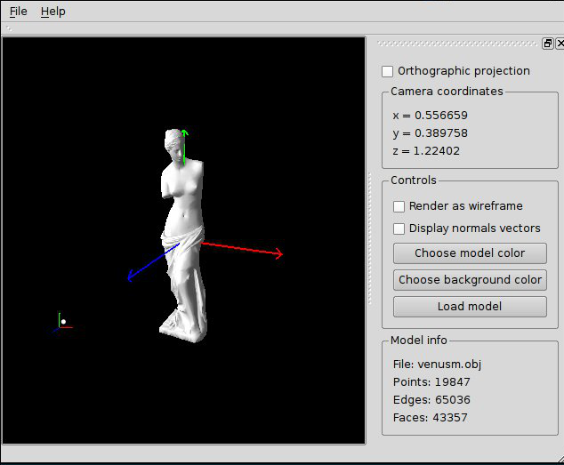

Orthogonal Perspective Demo
===========================
Demonstrates Orthographic projection from variable observer point.
Serves as practical part of bachelor's thesis at `Riga Technical University`.

:Author: Jānis Ābele <janis.abele@gmail.com>

Requirements
------------
In order to build opd you need the Qt4 header files.

Installation
------------
Enter the following command to build and install `opd`:

    qmake && make clean install

Running opd
-----------
Simply invoke the 'opd' command.

